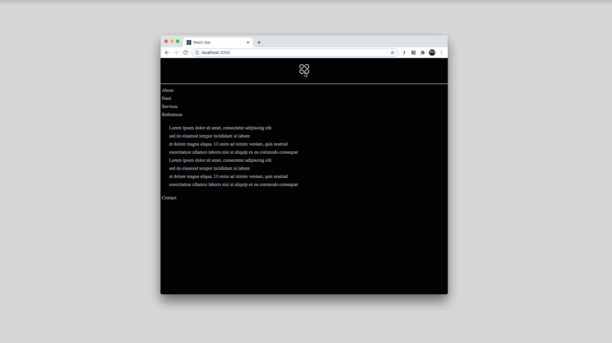

<div align="center">
  
  
  <hr />
  
  <br/>
  <p> Project Development </p>
  <h3> JavaScript </h3>
  <p> By Jessica Dosseh </p>
  
  <br/>
    <a href=""> Visit Website </a>
  <br/>
</div>

<hr/>

<div align="center">
  <br/>
  
</div>

<br/>

### Brief

---

Recreate the following technique as a react application.

<br/>

### Project Structure

---

```
src
├── assets
├── components
├── store/Mode
├── utils
```

<br/>

### Getting Started

---

**Project Set Up**

- [ ] Create a forked copy of this project.
- [ ] Clone your OWN version of the repository in your terminal.
- [ ] `git pull` to make sure you are uptodate
- [ ] `git checkout -b new-branch-name`
- [ ] Run `yarn` to install node_module.
- [ ] Run `yarn start` to start.

:rocket: DO your magic!

<br/>

### Development

---

| <div align="left"> Stack </div>                                                                    |                   |                                                      |
| -------------------------------------------------------------------------------------------------- | ----------------- | ---------------------------------------------------- |
| <div align="center">  </div> | React             | "A JavaScript library for building user interfaces." |
| <div align="center">  </div>    | Styled Components | "Visual primitives for components"                   |
